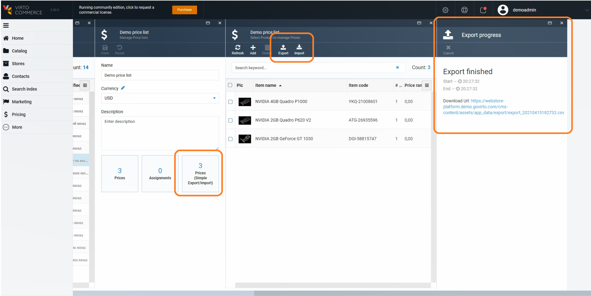

# Overview
If you want to transfer a large amount of price information between Virto Commerce and another system,
then you can use a specially-formatted spreadsheet to import or export that data. Virto Commerce uses CSV (comma-separated value) files to perform this kind of bulk task.

The business goal for the module is to provide to non-technical not high skilled business users (like "category manager") who works with prices on a daily basis and don't understand the database structure to work comfortably with prices export and import functionality using it for price management.

!!!note
    If you want to automated transferring information from 3rd party system, like ERP, then see API, Integration Middleware approach and Azure Logic Apps connectors.

## Business scenarios
* I need to export two pricelists to make comparing. 
* I need to change multiple prices in the price list of few hundreds of records in the price list of thousands of records.
* I need to make a bulk price update (+5% for everything) for a price list of thousands of records.
* I need to add prices for a batch of new products added to the catalog.

## Using CSV

### Get a sample CSV file
You can export and view a sample pricelist CSV file to use as a template.

* The file contains product prices. Your import file likely contains many product prices. If you use the sample file to create your own import file.
* The sample file includes the SKU column and prices. If you use products and you want to import or export catalog details, then use the catalog CSV file.

### Pricelist CSV file format
The first line of your multiple CSV file must be the column headers that are included in the sample CSV file and in the same order. Each column must be separated by a comma. The following lines (or records) in the file must contain data for your product using the same columns in that exact same order.

#### Overwriting Pricelist with an import CSV file

#### Description of the product import CSV file

### Create your Pricelist CSV file

## Importing pricelist

## Exporting pricelist

## Solutions to common product CSV import problems

## Development
The C# interfaces and implementation can be changed in next releases.
